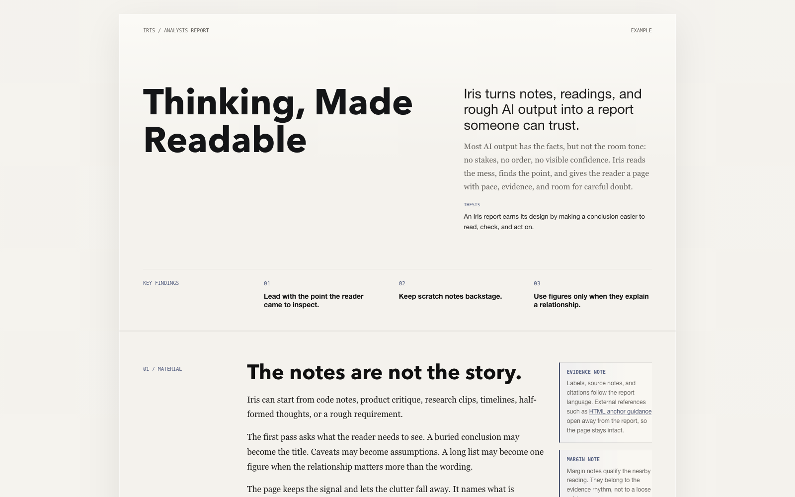

# Iris

<p align="center">
  
</p>

<h1 align="center">Iris</h1>

<p align="center">
  <strong>Turn AI analysis into editorial HTML reports.</strong>
</p>

Iris turns AI analysis, research notes, codebase readings, product judgments, and technical explanations into self-contained HTML reports.

Each report leads with a thesis, organizes findings around evidence, and closes with assumptions, open decisions, and next actions.

## Examples

Browse the GitHub Pages entry page from `docs/index.html`, or open the
finished reports directly:

- `docs/examples/editorial-method.html`
- `docs/examples/editorial-method-zh.html`

<p>
  <strong>English</strong><br>
  
</p>

<p>
  <strong>Chinese</strong><br>
  
</p>

## Use Iris For

- Codebase analysis reports
- Article summaries and interpretation
- Research notes and source synthesis
- Product or strategy judgments
- Technical explanations
- Requirements critique
- Thinking notes that need a clear conclusion

## How It Works

1. Read the source material.
2. Extract the thesis, findings, evidence, assumptions, open decisions, and next actions.
3. Compose a self-contained HTML report with the Iris template as the visual and structural reference.
4. Inspect the HTML at desktop and mobile widths.

Markdown can be useful as a private scratchpad while thinking. It is not the final deliverable. Iris delivers HTML.

## Core Files

| File | Purpose |
| --- | --- |
| `skills/iris/SKILL.md` | Main agent instructions |
| `skills/iris/references/content-method.md` | Content extraction and writing method |
| `skills/iris/references/design-system.md` | Visual system and report quality rules |
| `skills/iris/templates/report.html` | Canonical template reference |
| `docs/index.html` | GitHub Pages introduction page |
| `docs/examples/editorial-method.html` | Finished HTML example |
| `docs/examples/editorial-method-zh.html` | Finished Chinese HTML example |
| `skills.sh.json` | Optional grouping metadata for the skills.sh repo page |

## Install

Install Iris globally with the `skills` CLI:

```bash
npx -y skills add iCyris/Iris --skill iris -a '*' -g -y
```

This installs the `iris` skill from the public `iCyris/Iris` repository for all
supported agents on your machine.

Iris does not need an npm package for this install path. The `skills` CLI reads
the GitHub repository and installs the `skills/iris` folder directly.

Update Iris later with:

```bash
npx -y skills update iris -g -y
```

Remove Iris later with:

```bash
npx -y skills remove --global iris -y
```

The `skills remove` command removes installed skills by name. `--global` targets
the global install scope used above, and `-y` skips the confirmation prompt.

If you prefer to point directly at the skill folder, use the GitHub tree URL:

```bash
npx -y skills add https://github.com/iCyris/Iris/tree/main/skills/iris -a '*' -g -y
```

Flags:

- `-a '*'` installs for every supported agent.
- `-g` installs globally instead of only in the current project.
- `-y` accepts the install prompts.

The skill lives here:

```text
skills/iris
```

## Project Layout

```text
Iris/
├── .codex-plugin/
├── assets/logo/generated/
├── assets/readme/
├── docs/
│   ├── assets/
│   ├── examples/
│   └── index.html
├── skills/iris/
│   ├── SKILL.md
│   ├── agents/
│   ├── assets/
│   ├── references/
│   └── templates/report.html
├── AGENTS.md
├── BRAND.md
├── CLAUDE.md
├── asset-manifest.json
└── skills.sh.json
```

## License

MIT License. See [LICENSE](LICENSE).
